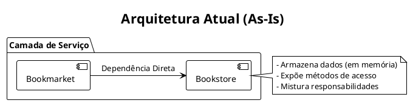

# Evolução da Arquitetura: BookMarketCore

Este documento apresenta uma análise comparativa entre a arquitetura atual ("As-Is") e a arquitetura futura proposta ("To-Be") para o projeto BookMarketCore. O objetivo é justificar as decisões de design e demonstrar os benefícios da evolução arquitetural.

---

## 1. Arquitetura Atual (As-Is)

A arquitetura inicial do projeto é funcional, mas apresenta um design monolítico onde as responsabilidades não estão claramente separadas.

### Descrição

Neste modelo, a classe de serviço `Bookmarket` acessa diretamente a classe `Bookstore` para obter dados. A `Bookstore` atua simultaneamente como um serviço e como um repositório de dados em memória, o que viola o Princípio da Responsabilidade Única (SRP).

### Pontos Positivos
- **Simplicidade Inicial:** Para um protótipo rápido, ter poucas classes torna o fluxo de código mais direto e fácil de seguir.
- **Rápido Desenvolvimento Inicial:** Menos "boilerplate" (código de infraestrutura) para começar a desenvolver as funcionalidades.

### Pontos Negativos (Riscos)
- **Alto Acoplamento:** A camada de negócio (`Bookmarket`) está fortemente acoplada à implementação da persistência em memória (`Bookstore`).
- **Baixa Testabilidade:** É impossível testar a lógica de negócio em `Bookmarket` de forma isolada sem depender de todo o estado e da lógica de `Bookstore`.
- **Difícil Manutenção e Evolução:** Se quisermos trocar o armazenamento em memória por um banco de dados (ex: PostgreSQL), seríamos forçados a alterar a classe `Bookmarket` extensivamente, pois ela depende diretamente da implementação de `Bookstore`.
- **Violação de Princípios SOLID:** A classe `Bookstore` acumula múltiplas responsabilidades, tornando-se difícil de manter e entender.

---

## 2. Arquitetura Futura (To-Be)

A arquitetura proposta introduz uma separação clara de responsabilidades através de interfaces e serviços especializados, preparando o sistema para crescimento e manutenção a longo prazo.

### Descrição

Neste modelo, a camada de serviço (`Bookmarket`) não depende mais da implementação concreta (`Bookstore`), mas sim de **interfaces de repositório** (ex: `BookRepository`, `OrderRepository`). Além disso, a complexidade do motor de recomendação é extraída para um serviço próprio, o `RecommendationService`.

A classe `Bookstore` passa a ter uma única responsabilidade: ser a **implementação em memória** das interfaces de repositório.

*(Para um diagrama detalhado, consulte: [Diagrama de Componentes](./diagrams/COMPONENT_DIAGRAM.puml))*

### Pontos Positivos
- **Baixo Acoplamento (Inversão de Dependência):** A camada de negócio depende de abstrações (interfaces), não de implementações. Isso permite trocar a fonte de dados (de memória para um banco de dados) sem alterar nenhuma linha de código na classe `Bookmarket`.
- **Alta Testabilidade:** A lógica de negócio em `Bookmarket` pode ser testada de forma isolada e confiável, utilizando "mocks" (implementações falsas) das interfaces de repositório.
- **Alta Coesão e SRP:** Cada componente tem uma responsabilidade clara:
  - `Bookmarket`: Orquestra a lógica de negócio.
  - `RecommendationService`: Lida exclusivamente com a lógica do Mahout.
  - `Repositorios`: Definem como acessar os dados.
  - `Bookstore`: Implementa o acesso em memória.
- **Escalabilidade e Manutenibilidade:** Adicionar novas funcionalidades ou alterar as existentes se torna muito mais fácil e seguro, pois os componentes são independentes.

### Pontos Negativos
- **Maior Número de Arquivos:** A introdução de interfaces e novas classes aumenta o número de arquivos no projeto.
- **Curva de Aprendizagem Levemente Maior:** Para um desenvolvedor novo, o fluxo de dados que passa por interfaces pode exigir um pequeno tempo de adaptação em comparação com a chamada direta de métodos concretos.

---

## 3. Tabela Comparativa

| Critério | Arquitetura Atual (As-Is) | Arquitetura Futura (To-Be) | Benefício da Mudança |
| :--- | :--- | :--- | :--- |
| **Acoplamento** | Alto | **Baixo** | Permite trocar a implementação da persistência sem alterar a lógica de negócio. |
| **Testabilidade** | Baixa | **Alta** | Testes unitários focados e rápidos para a lógica de negócio, usando mocks. |
| **Manutenibilidade**| Difícil | **Fácil** | Alterações são localizadas e têm menor risco de quebrar outras partes do sistema. |
| **Escalabilidade** | Baixa | **Alta** | A estrutura modular facilita a adição de novas funcionalidades e fontes de dados. |
| **Adesão ao SOLID** | Baixa | **Alta** | O design respeita princípios como Responsabilidade Única e Inversão de Dependência. |
